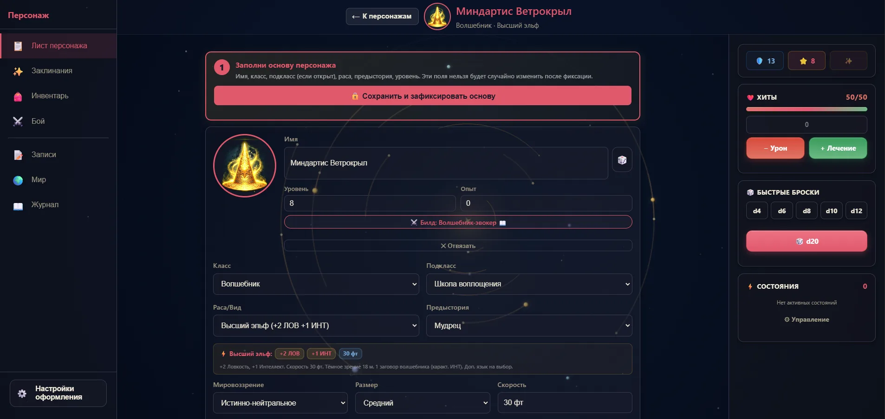
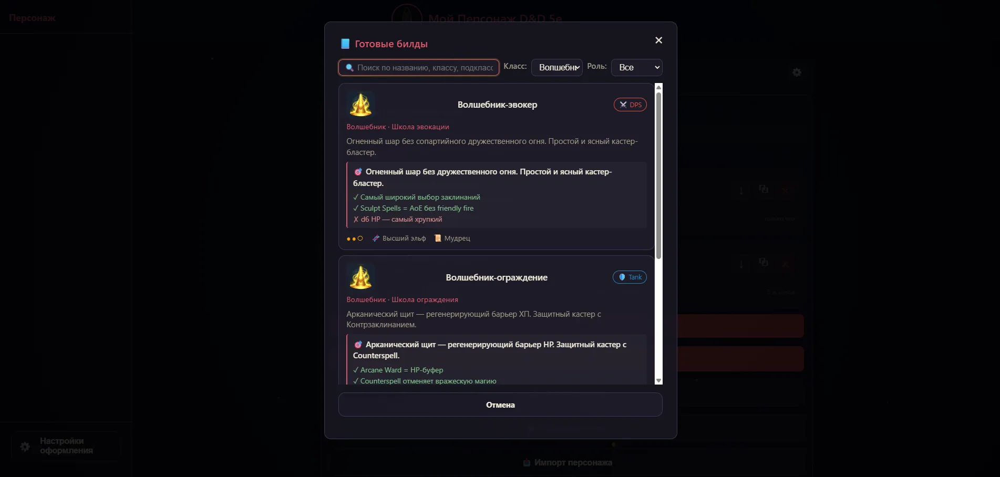
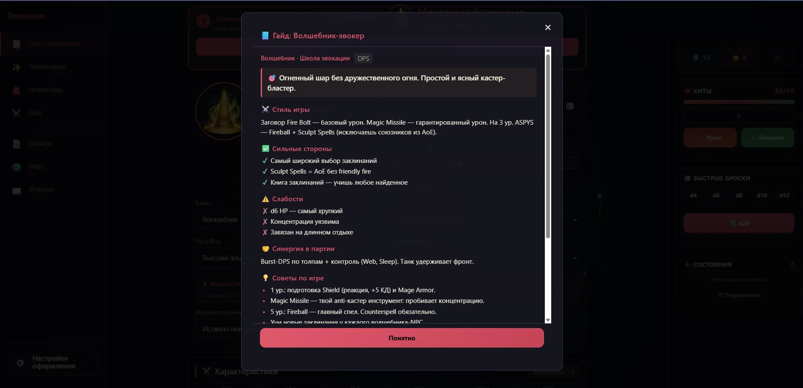
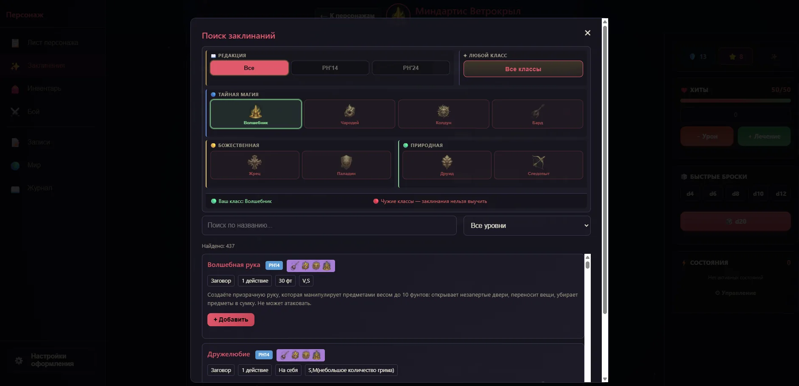
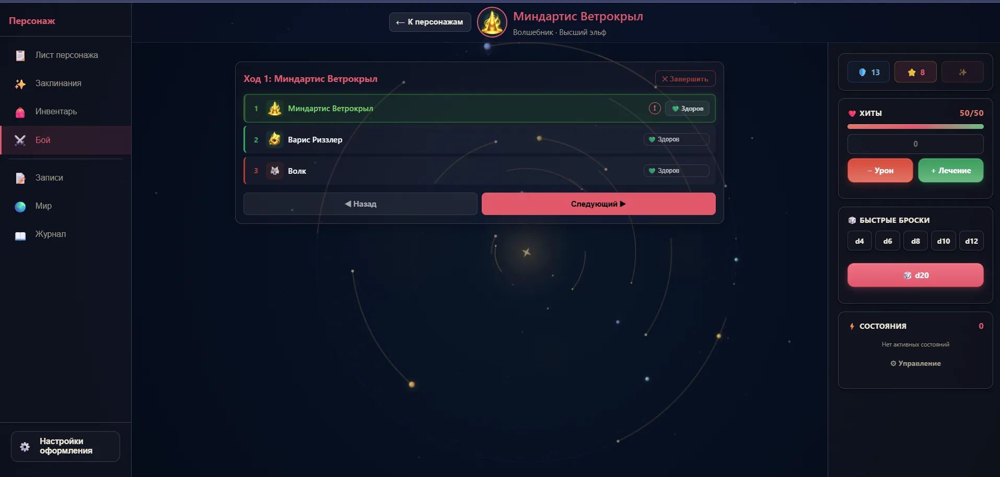

# DnD-Лист

**Лист персонажа D&D 5e для браузера и телефона. На русском, без регистрации, оффлайн, бесплатно.**

🎲 **[Открыть приложение →](https://d1manych.github.io/dnd-app/)** &nbsp;&nbsp; 💬 **[Telegram @dndlistru](https://t.me/dndlistru)**

---

## Что это

PWA-приложение для ведения персонажа D&D 5e. Открываешь ссылку — и сразу играешь. Данные хранятся в браузере, всё работает оффлайн после первой загрузки. Регистрация не нужна, облака нет — всё на твоём устройстве.

## Что внутри

| | |
|---|---|
| 🎯 **36 готовых билдов** | 3 на каждый из 12 классов PHB. Гайд развития 1–20 уровень, стиль игры, плюсы/минусы, синергия. |
| 📜 **706 заклинаний** | Вся база PHB (PH14 + PH24). Поиск, фильтр по классам, управление ячейками, концентрация, ритуалы. |
| 🎲 **3D-кубики** | Физический бросок d20, d100, костей хитов. WebGL, деревянный поднос, история бросков. |
| ⚔️ **Боевая система** | Инициатива, 28+ состояний, спасброски от смерти, трекер партии с союзниками и врагами. |
| 🎒 **Инвентарь** | Снаряжение, предметы и деньги персонажа. |
| 📝 **Записи и журнал** | NPC, квесты, локации, сессии, зацепки. Markdown, теги, типы, фильтры, поиск, экспорт `.md`/`.json`. |
| 🎓 **Обучение и туры** | Приветствие для новичков, контекстные подсказки «?» и интерактивные туры по каждой вкладке. |
| 🎨 **Кастомизация** | Темы (светлая/тёмная/авто), 8 акцентов (авто по классу), плотность UI и масштаб шрифта; групповые карточки характеристик в стиле 2024; переключатель редакции 2014/2024 (2024 в разработке). |
| 📱 **PWA** | Устанавливается на главный экран телефона, работает оффлайн. Свайпы, safe-area, хитбоксы ≥44px. |
| 💾 **Импорт/экспорт** | JSON-бэкапы, не разрушающая миграция между устройствами. |

## Скриншоты

| Лист персонажа | Готовые билды | Гайд по билду |
|---|---|---|
|  |  |  |

| Заклинания | 3D-кубики | Боевой трекер |
|---|---|---|
|  |  |  |

## Как пользоваться

1. Открой **[d1manych.github.io/dnd-app](https://d1manych.github.io/dnd-app/)**
2. На мобильном — «Добавить на главный экран» в меню браузера (Chrome / Safari)
3. Создай персонажа вручную или возьми готовый билд
4. Играй — данные сохранятся локально

Для бэкапа или переноса на другое устройство — кнопка «Экспорт» в меню. Импорт не перезаписывает существующих персонажей, а добавляет.

## Поддержать проект

- ⭐ **Звезда на GitHub** — повышает видимость проекта
- 💬 **[Telegram @dndlistru](https://t.me/dndlistru)** — апдейты, опросы, заметки разработки
- ☕ **Boosty** — позже, когда соберётся комьюнити

Проект бесплатный и таким останется. Все фичи доступны всем — без paywall.

## Как это сделано

Это мой **первый проект в разработке** — без профильного образования, программировать раньше не учился. Взялся просто из желания сделать удобный лист для своей пати и делаю его с помощью ИИ, открыто:

- 🤖 **Claude** — код приложения
- 🎨 **Gemini и ChatGPT** — изображения и иконки

Стек намеренно простой, без сборщика и runtime-зависимостей: ванильный **JavaScript + HTML + CSS**, **PWA** (Service Worker + manifest) для оффлайна и установки, 3D-кубики на **WebGL** (`@3d-dice/dice-box`). ИИ для меня — инструмент: что добавить, как оно должно работать и как играется за реальным столом, решаю и проверяю я сам.

## Версия и обновления

Текущая: **v3.28.36** (20 июня 2026).

Из недавнего (версии 3.25–3.28): обучение и интерактивные туры по вкладкам, центр справки с контекстными кнопками «?», переключатель редакции 2014/2024, групповые карточки характеристик в стиле 2024, журнал событий и обновлённый интерфейс (fantasy-modern), а также сверка названий (навыки, раса и язык, заклинания, магические предметы, умения классов) с Книгой Игрока и Руководством Мастера 2014.

Полный changelog — массив `APP_CHANGELOG` в [data.js](data.js) или в самом приложении: меню → «📜 История версий».

## Для разработчиков

Архитектура, схема данных, миграции, ключевые функции → [docs/ARCHITECTURE.md](docs/ARCHITECTURE.md)

Запуск локально: любой статический сервер из корня (`python3 -m http.server` подойдёт). PWA-функции требуют `https` или `localhost`.

Тесты: `node tests/headless-node.js` для логики, `tests/runner.html` для браузерных.
