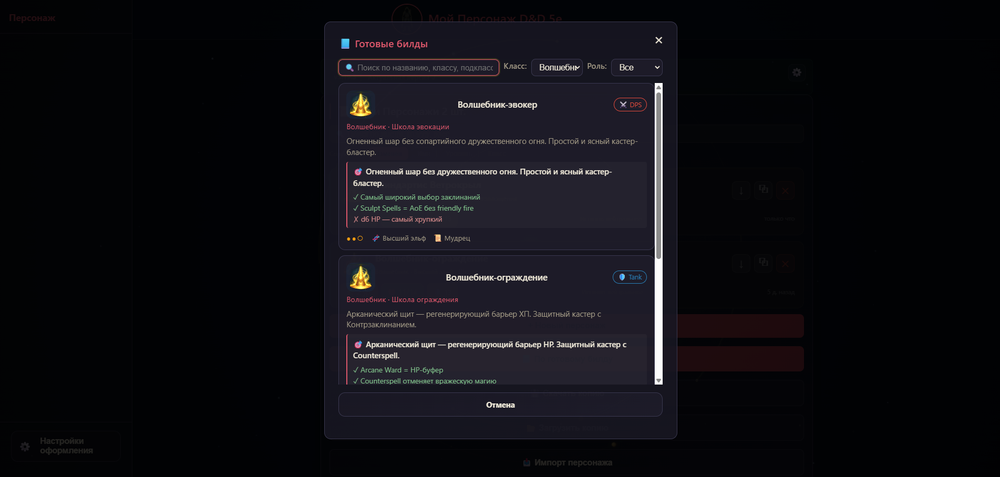
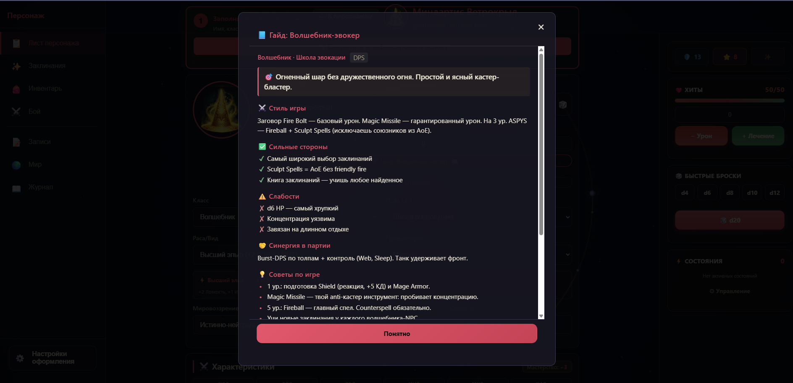
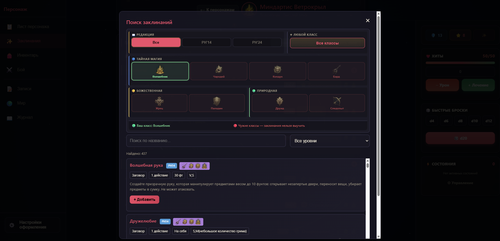
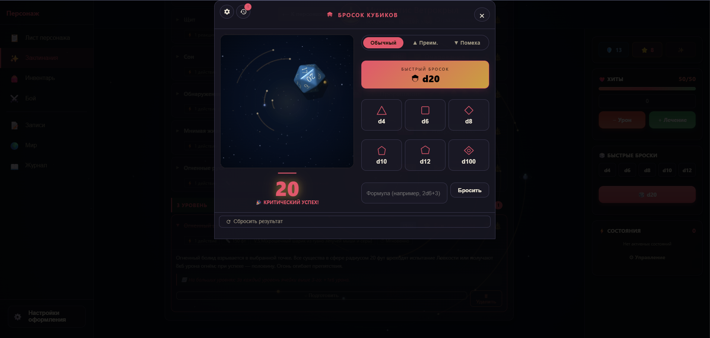
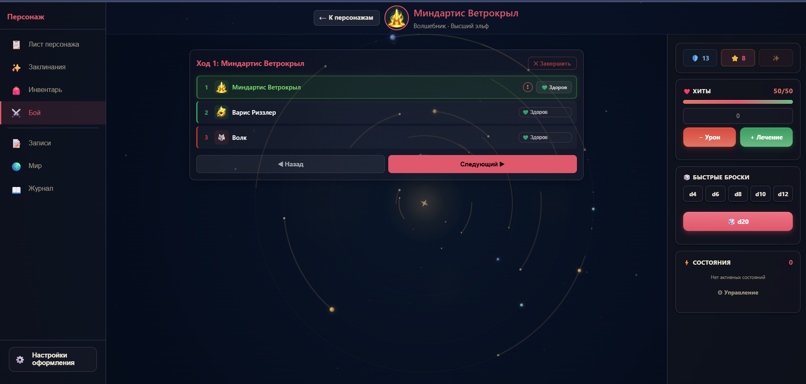

# DnD-Лист

**Лист персонажа D&D 5e для браузера и телефона. На русском, без регистрации, оффлайн, бесплатно.**

🎲 **[Открыть приложение →](https://d1manych.github.io/dnd-app/)** &nbsp;&nbsp; 💬 **[Telegram @dndlistru](https://t.me/dndlistru)**

---

## Что это

PWA-приложение для ведения персонажа D&D 5e. Открываешь ссылку — и сразу играешь. Данные хранятся в браузере, всё работает оффлайн после первой загрузки. Регистрация не нужна, облака нет — всё на твоём устройстве.

## Что внутри

| | |
|---|---|
| 🎯 **40 готовых билдов** | 3–4 на каждый из 12 классов PHB. Гайд развития 1–20 уровень, стиль игры, плюсы/минусы, синергия. |
| 📜 **712 заклинаний** | Вся база PHB (PH14 + PH24). Поиск, фильтр по классам, управление ячейками, концентрация, ритуалы. |
| 🎲 **3D-кубики** | Физический бросок d20, d100, костей хитов. WebGL, деревянный поднос, история бросков. |
| ⚔️ **Боевая система** | Инициатива, 28+ состояний, спасброски от смерти, трекер партии с союзниками и врагами. |
| 📝 **Записи кампании** | NPC, квесты, локации, сессии. Markdown, теги, поиск, экспорт `.md`/`.json`. |
| 🎨 **Кастомизация** | Светлая/тёмная/авто тема, 8 цветовых акцентов (авто по классу), 3 плотности UI, масштаб шрифта 90–130%. |
| 📱 **PWA** | Устанавливается на главный экран телефона, работает оффлайн. Свайпы, safe-area, хитбоксы ≥44px. |
| 💾 **Импорт/экспорт** | JSON-бэкапы, не разрушающая миграция между устройствами. |

## Скриншоты

> Готовятся — обновим в ближайшие дни.

<!-- Когда файлы появятся в docs/screenshots/, заменить блок выше на:

| Лист персонажа | Готовые билды | Гайд по билду |
|---|---|---|
|  |  |  |

| Заклинания | 3D-кубики | Боевой трекер |
|---|---|---|
|  |  |  |

Подробнее о требованиях к скринам — [docs/screenshots/README.md](docs/screenshots/README.md).
-->

## Как пользоваться

1. Открой **[d1manych.github.io/dnd-app](https://d1manych.github.io/dnd-app/)**
2. На мобильном — «Добавить на главный экран» в меню браузера (Chrome / Safari)
3. Создай персонажа вручную или возьми готовый билд
4. Играй — данные сохранятся локально

Для бэкапа или переноса на другое устройство — кнопка «Экспорт» в меню. Импорт не перезаписывает существующих персонажей, а добавляет.

## Поддержать проект

- ⭐ **Звезда на GitHub** — повышает видимость проекта
- 💬 **[Telegram @dndlistru](https://t.me/dndlistru)** — новости, разборы билдов, апдейты
- ☕ **Boosty** — позже, когда соберём комьюнити

Проект бесплатный и таким останется. Все фичи доступны всем — без paywall.

## Версия и обновления

Текущая: **v3.19.3** (24 мая 2026).

Полный changelog — массив `APP_CHANGELOG` в [data.js](data.js) или в самом приложении: меню → «📜 История версий».

## Для разработчиков

Архитектура, схема данных, миграции, ключевые функции → [docs/ARCHITECTURE.md](docs/ARCHITECTURE.md)

Запуск локально: любой статический сервер из корня (`python3 -m http.server` подойдёт). PWA-функции требуют `https` или `localhost`.

Тесты: `node tests/headless-node.js` для логики, `tests/runner.html` для браузерных.
