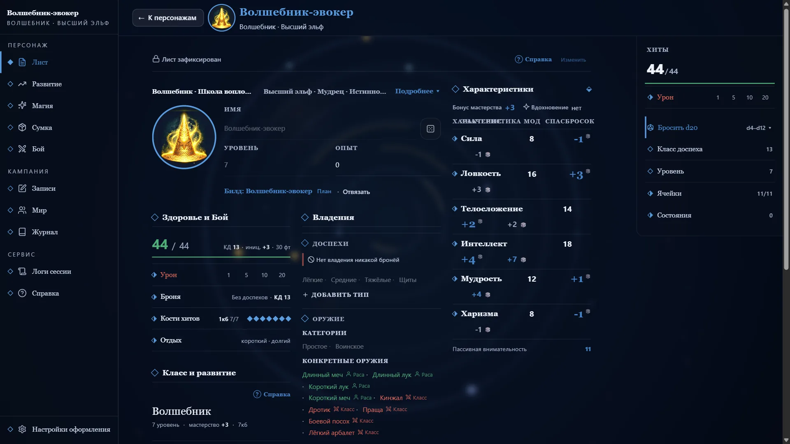
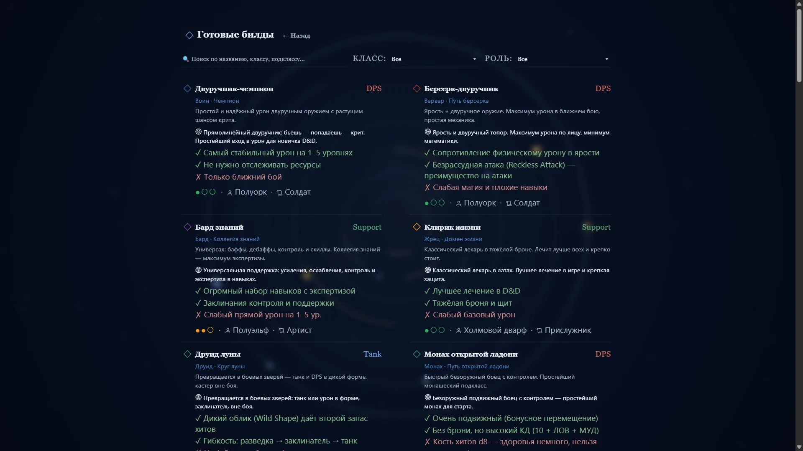
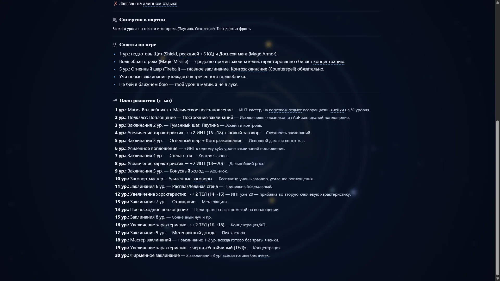
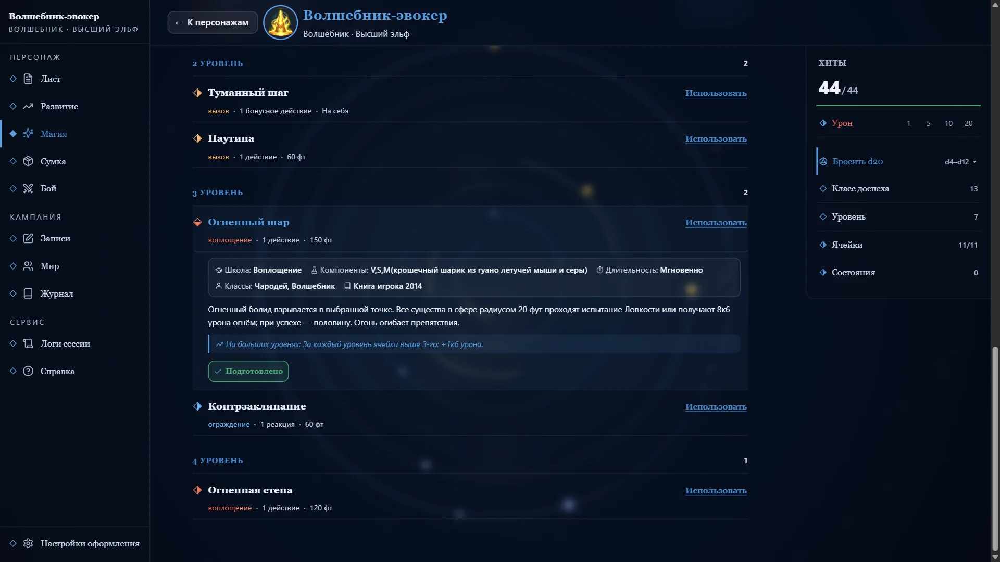
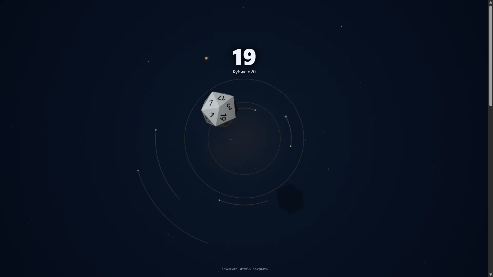
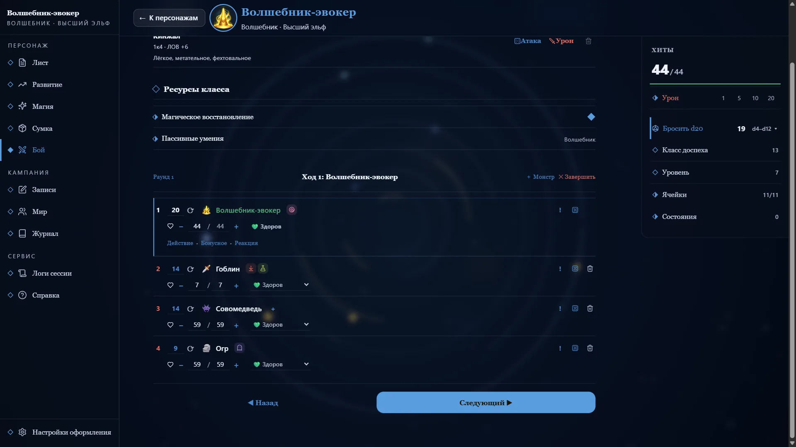

# DnD-Лист

**Лист персонажа D&D 5e для браузера и телефона. На русском, без регистрации, оффлайн, бесплатно.**

🎲 **[Открыть приложение →](https://d1manych.github.io/dnd-app/)** &nbsp;&nbsp; 💬 **[Telegram @dndlistru](https://t.me/dndlistru)** &nbsp;&nbsp; 🇬🇧 [English](README.en.md)

---

## Что это

PWA-приложение для ведения персонажа D&D 5e. Открываешь ссылку — и сразу играешь. Персонажи хранятся в браузере, всё работает оффлайн после первой загрузки. Регистрация не нужна, своего сервера нет — данные остаются на твоём устройстве. По желанию можно синхронизировать свои устройства через файл на твоём Google Диске ([что хранится](https://d1manych.github.io/dnd-app/privacy.html)).

## Что внутри

| | |
|---|---|
| 📚 **Две редакции** | Правила 2014 и 2024, выбираются для каждого персонажа. У каждого персонажа свой набор подключённых книг. |
| 🎯 **48 готовых билдов** | Для каждого класса: гайд развития 1–20 уровень, стиль игры, плюсы и минусы. |
| 📜 **760 заклинаний** | Поиск, фильтр по классам, ячейки, концентрация, ритуалы. Кнопка **«Использовать»** применяет механику: тратит ячейку, бросает урон или лечение с учётом апкаста, делает бросок атаки заклинанием, вешает баффы и дебаффы в боевом трекере. |
| 🎲 **3D-кубики** | Физический бросок на WebGL, история бросков. |
| ⚔️ **Бой** | Инициатива, состояния, спасброски от смерти, трекер партии с союзниками и монстрами из бестиария SRD. |
| 🎒 **Инвентарь** | Снаряжение, оружие с весом, ценой и владениями, магические предметы, деньги. |
| 🔒 **Замок листа** | То, что меняется только при повышении уровня, во время игры закрыто — лист случайно не сломать. |
| 📝 **Записи** | NPC, квесты, локации, сессии. Markdown, теги, поиск, экспорт `.md`/`.json`. |
| 🎓 **Обучение** | Приветствие для новичков, подсказки «?» и туры по каждой вкладке. |
| 🎨 **Оформление** | Светлая, тёмная и авто-тема, акценты по классу, плотность и масштаб шрифта. |
| 📱 **PWA** | Устанавливается на главный экран, работает оффлайн, раскладки для телефона и компьютера. |
| 💾 **Бэкапы** | Экспорт и импорт JSON, синхронизация через Google Диск, PDF листа. |

## Скриншоты

| Лист персонажа | Готовые билды | Гайд по билду |
|---|---|---|
|  |  |  |

| Заклинания | 3D-кубики | Боевой трекер |
|---|---|---|
|  |  |  |

## Как пользоваться

1. Открой **[d1manych.github.io/dnd-app](https://d1manych.github.io/dnd-app/)**
2. На мобильном — «Добавить на главный экран» в меню браузера (Chrome / Safari)
3. Создай персонажа вручную или возьми готовый билд
4. Играй — данные сохранятся локально

Для бэкапа и переноса — экран «Данные»: экспорт в файл или синхронизация через Google Диск. Импорт не перезаписывает существующих персонажей, а добавляет.

## Поддержать проект

- ⭐ **Звезда на GitHub** — повышает видимость проекта
- 💬 **[Telegram @dndlistru](https://t.me/dndlistru)** — апдейты, опросы, заметки разработки
- ☕ **[Boosty](https://boosty.to/d1manych/donate)** — разовая поддержка

Проект бесплатный и таким останется. Все функции доступны всем — без paywall.

## Как это сделано

Это мой **первый проект в разработке** — без профильного образования, программировать раньше не учился. Взялся просто из желания сделать удобный лист для своей пати и делаю его с помощью ИИ, открыто:

- 🤖 **Claude (Claude Code)** — код приложения
- 🎨 **Gemini и ChatGPT** — изображения и иконки

Стек намеренно простой, без сборщика и runtime-зависимостей: ванильный **JavaScript + HTML + CSS**, **PWA** (Service Worker + manifest) для оффлайна и установки, 3D-кубики на **WebGL** (`@3d-dice/dice-box`). ИИ для меня — инструмент: что добавить, как оно должно работать и как играется за реальным столом, решаю и проверяю я сам.

## Версия и обновления

Текущая: **v4.32.2** (8 октября 2026).

Полный changelog — [CHANGELOG.md](CHANGELOG.md) или в самом приложении: меню → «📜 История версий».
Что именно менялось в коде — [docs/RELEASES.md](docs/RELEASES.md): коммиты, изменённые файлы и ссылка на полный патч каждой версии.

## Для разработчиков

Архитектура, схема данных, миграции, ключевые функции → [docs/ARCHITECTURE.md](docs/ARCHITECTURE.md)

Запуск локально: любой статический сервер из корня (`python3 -m http.server` подойдёт). PWA-функции требуют `https` или `localhost`.

Тесты: `node tests/headless-node.js` для логики, `tests/runner.html` для браузерных.
